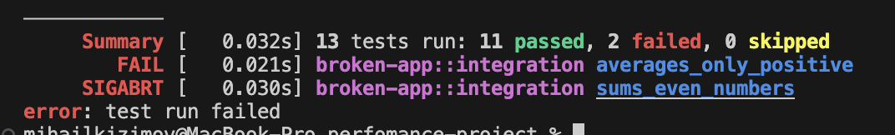
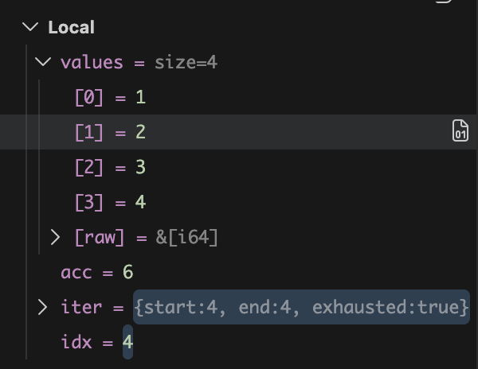

### Отладчик
Падают 2 теста: 
**sums_even_numbers** - отладка показывает, что мы выходим за пределы массива (len = 4, idx = 4):


**averages_only_positive** - с отладкой, да и без нее видно что нет фильтра на положительные числа.

### Miri & Valgrind
```cargo +nightly miri test -p broken-app --test integration```
1. Показывает memory leak в функции ```leak_buffer```.
2. Показывает UB в use_after_free (пришлось добавить тест который вызывает эту функцию)

**Valgrind** - после фиксов от MIRI не показывает ошибок, есть только непочищенная память от самой программы в конце, но это чистит ОС.

