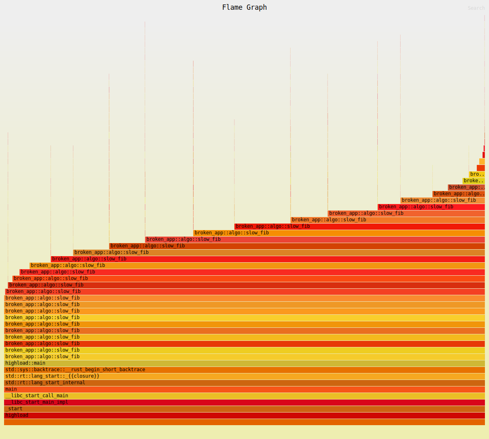
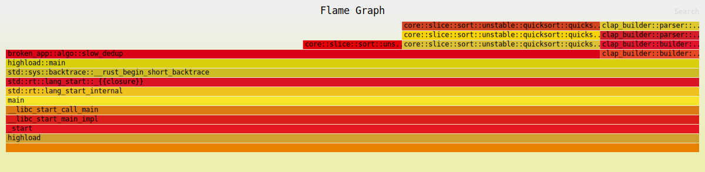
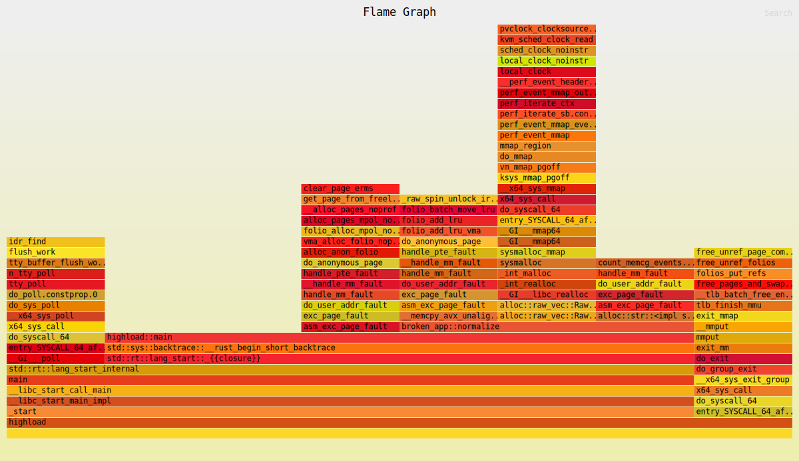

# Отчёт по отладке и оптимизации broken-app

## 1. Отладка: падающие тесты

| Тест | Проблема | Причина |
|------|----------|---------|
| `sums_even_numbers` | Выход за пределы массива | `get_unchecked(idx)` при `idx = len` (off-by-one) |
| `averages_only_positive` | Неверный результат | Отсутствует фильтрация по положительным числам |

## 2. Анализ безопасности памяти

### Miri (`cargo +nightly miri test`)

Обнаружено **2 проблемы**:

1. **Memory leak** в функции `leak_buffer` — выделенная память не освобождалась (`Box::from_raw` не вызывался).
2. **Use-after-free** в `use_after_free` — обращение к `*raw` после `drop(Box::from_raw(raw))`. Для обнаружения потребовалось добавить тест, вызывающий эту функцию (Miri анализирует только исполняемый код).

### Valgrind (`valgrind --leak-check=full --show-leak-kinds=all`)

После исправлений по результатам Miri — **ошибок не обнаружено**. Единственная "утечка" — 544 байта `still reachable` из стандартной библиотеки Rust (инициализация рантайма), освобождается ОС при завершении процесса.

## 3. Профилирование: flamegraph

Flamegraph-отчёты для каждой функции сохранены в `reports/flamegraph-*.svg`.

### slow_fib

Функция `slow_fib` занимает **99.98%** всего времени. На графе видна глубокая рекурсивная цепочка вызовов — классическая экспоненциальная сложность O(2^n) без мемоизации.

### slow_dedup

Основное время уходит на многократные вызовы `sort_unstable` — сортировка выполняется **на каждой вставке** нового элемента, что даёт сложность O(n^2 log n).

### normalize

Явных узких мест не выявлено — время распределено равномерно между `replace` и `to_lowercase`.

## 4. Бенчмарки (Criterion)

Исходные файлы: `benches/criterion.rs`
Результаты: `artifacts/baseline_before.txt`, `baseline_after.txt`, `normalize_after.txt`

### До и после оптимизации fib и dedup (`baseline_after.txt`)

| Функция | Было | Стало | Улучшение | Что изменилось |
|---------|------|-------|-----------|----------------|
| `fib(32)` | 9.0 ms | 32 ns | **-99.99%** | Итеративная реализация вместо экспоненциальной рекурсии |
| `dedup(5000)` | 15.2 ms | 425 µs | **-97%** | Убрана сортировка на каждой вставке, O(n log n) вместо O(n^2) |
| `sum_even` | 528 ns — 29.5 µs | 431 ns — 20.5 µs | -17..23% | Побочный эффект от исправления UB |

### После исправления normalize (`normalize_after.txt`)

| Размер | Было | Стало | Изменение |
|--------|------|-------|-----------|
| 1K | 2.64 µs | 2.67 µs | В пределах погрешности |
| 50K | 105.8 µs | 105.8 µs | В пределах погрешности |
| 500K | 947 µs | 1.16 ms | +28% |

Normalize стала медленнее на больших входных данных, но исправление было направлено на **корректность логики**, а не на ускорение. Прежняя реализация (`replace(' ', "").to_lowercase()`) давала неверный результат.

## 5. Инструменты

| Команда | Назначение |
|---------|-----------|
| `make valgrind` | Запуск Valgrind на всех тестовых бинарниках |
| `make miri` | Запуск Miri |
| `make flamegraph` | Генерация flamegraph для normalize, fib, dedup |
| `cargo bench --bench criterion` | Запуск бенчмарков |
